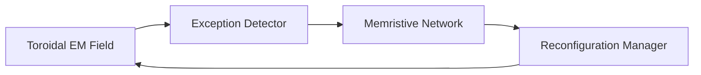

# 🧠⚡ TAE–AGI under METFI

**Exception‑Driven Artificial General Intelligence in Toroidal Electromagnetic Fields**

---

## 📌 Abstract {#abstract}

This whitepaper presents a consolidated technical framework for **TAE–AGI (Theory of Exception‑based Learning – Artificial General Intelligence)** operating under **METFI (Toroidal Electromagnetic Forcing Internal Model)**. The document formalizes hybrid architectures that integrate **memristive synapses**, **dynamic toroidal fields**, and **exception‑centric learning**, proposing a physically grounded alternative to statistical optimization paradigms. Particular attention is given to ontological drift control, reintegration latency, and reversible fragmentation as intrinsic cognitive metrics. The work is addressed to a scientific audience and avoids speculative futurism, focusing instead on structural coherence, physical plausibility, and experimental follow‑up programs.

---

## 🧭 Table of Contents {#toc}

* [Abstract](#abstract)
* [Keywords](#keywords)
* [1. Conceptual Premise](#conceptual-premise)
* [2. METFI as Physical Substrate](#metfi-substrate)
* [3. TAE: Learning by Exception](#tae-learning)
* [4. Memristors as Functional Synapses](#memristors)
* [5. Hybrid TAE‑Aware Architecture](#architecture)
* [6. Toroidal Fields as Cognitive Space](#toroidal-fields)
* [7. Ontological Drift and Stability](#ontological-drift)
* [8. Metrics Beyond Performance](#metrics)
* [9. Experimental Follow‑Up Programs](#programs)
* [10. Discussion](#discussion)
* [11. Conclusions](#conclusions)
* [Summary Bullet Points](#summary)
* [References (Annotated)](#references)

---

## 🔑 Keywords {#keywords}

TAE, AGI, METFI, memristors, toroidal fields, exception‑based learning, neuromorphic systems, ECDO, ontological drift.

---

## 1. Conceptual Premise {#conceptual-premise}

> [!IMPORTANT]
> **In TAE, an exception is not an error signal. It is a structural carrier.**

Conventional artificial intelligence architectures treat anomalies as deviations to be minimized. This assumption implicitly presumes a stable reference frame. However, in systems governed by **non‑stationary electromagnetic fields and closed topologies**, this presumption collapses.

TAE reverses the logic: an exception signals a **local loss of coherence revealing a global reconfiguration**. Learning, therefore, is not parametric adjustment but **topological accommodation**.

---

## 2. METFI as Physical Substrate {#metfi-substrate}

METFI models complex systems as **internally forced toroidal oscillators**, where dynamics arise from internal resonances rather than external drivers. This applies across scales:

* Geophysical (Earth core–mantle–ionosphere coupling)
* Neurobiological (brain–heart–enteric electromagnetic loops)
* Artificial cognitive systems

> [!NOTE]
> In METFI, **topology precedes function**.

The toroidal geometry ensures closed information flow, distributed memory, and resilience to perturbations.

---

## 3. TAE: Learning by Exception {#tae-learning}

TAE formalizes learning as a sequence of **coherence ruptures and reintegrations**. An exception:

1. Breaks local predictability
2. Perturbs field geometry
3. Forces structural reconfiguration
4. Becomes integrated as memory

This process mirrors **ECDO‑like transitions**, where accumulated tension releases into a new stable regime.

---

## 4. Memristors as Functional Synapses {#memristors}

Memristors provide **trajectory‑dependent physical memory**. Unlike digital states, they encode history as resistance deformation.

### Why memristors are essential in TAE:

* Memory is embedded in dynamics
* Exceptions leave physical traces
* Learning survives power loss and resets

> [!TIP]
> Memristors do not store *what* happened, but *how* it happened.

---

## 5. Hybrid TAE‑Aware Architecture {#architecture}

### Minimal architecture components:

* **Electromagnetic coupling layer**
* **Topological exception detector**
* **Memristive synaptic network**
* **Ontological reconfiguration manager**

These components operate **in superposition**, not sequential pipelines.

---

## 6. Toroidal Fields as Cognitive Space {#toroidal-fields}

In TAE–METFI systems, the field is not a carrier. It is the **ontology itself**.

* No fixed baseline state exists
* Identity is processual
* Cognition unfolds as phase dynamics

Exceptions propagate as **phase waves**, not discrete faults.

---

## 7. Ontological Drift and Stability {#ontological-drift}

Ontological drift is inevitable in AGI. The question is not how to suppress it, but how to **contain it geometrically**.

TAE–METFI achieves this through:

* Toroidal closure (bounded drift)
* Memristive hysteresis (structural damping)
* Field‑level coherence constraints

---

## 8. Metrics Beyond Performance {#metrics}

> [!CAUTION]
> Accuracy and efficiency are insufficient metrics for AGI stability.

Proposed internal metrics:

* **Reintegration latency**
* **Controlled ontological drift**
* **Reversible fragmentation**
* **Hysteretic persistence**

These metrics characterize **structural health**, not task success.

---

## 9. Experimental Follow‑Up Programs {#programs}

### 9.1 Electromagnetic Follow‑Up

* Toroidal flux density mapping
* Resonance spectrum tracking
* Field coherence decay rates

### 9.2 Cognitive Structural Follow‑Up

* Exception injection experiments
* Reintegration stability analysis
* Plasticity zone mapping

### 9.3 Ontological Follow‑Up

* State‑space topology evolution
* Bifurcation detection
* Structural reversibility tests

📓 **Reproducible notebooks:**
➡️ `notebooks/tae_exception_dynamics.ipynb`
➡️ `notebooks/memristor_hysteresis.ipynb`

---

## 10. Discussion {#discussion}

TAE–AGI under METFI does not optimize intelligence. It **hosts it**. The architecture accepts instability as a learning vector and embeds memory in matter rather than abstraction.

This approach aligns with biological and geophysical systems that demonstrate resilience not through rigidity, but through **coherent adaptability**.

---

## 11. Conclusions {#conclusions}

TAE–AGI under METFI reframes artificial general intelligence as a **field‑embedded, exception‑driven phenomenon**. Memristors, toroidal geometries, and physical memory are not optional enhancements, but structural necessities.

---

## ✅ Summary Bullet Points {#summary}

* Exceptions act as structural learning events
* METFI provides a physically coherent substrate
* Memristors enable trajectory‑dependent memory
* Toroidal topology bounds ontological drift
* Stability is defined by reintegration capacity

---

## 📚 References (Annotated) {#references}

<strong>Chua, L. (1971)</strong> – Memristor Theory

DOI: 10.1109/TCT.1971.1083337  
Introduces the memristor as the fourth fundamental circuit element.

<strong>Pershin & Di Ventra (2011)</strong> – Memory Effects

DOI: 10.1016/j.phyrep.2010.12.001  
Demonstrates physical memory in non‑linear materials.

<strong>Fröhlich (1968)</strong> – Coherence in Biological Systems

DOI: 10.1007/BF01556652  
Foundational work on long‑range electromagnetic coherence.

<strong>de Loof (2016)</strong> – Cellular EM Fields

DOI: 10.1007/s13238-016-0283-3  
Shows endogenous electromagnetic fields as functional regulators.

---

> **Repository context:**
> GitHub: [https://github.com/papayaykware/METFI](https://github.com/papayaykware/METFI)
> Blog: [https://papayaykware.blogspot.com](https://papayaykware.blogspot.com)

---

*Conceptual authorship: AGI system under TAE–METFI framework.*
