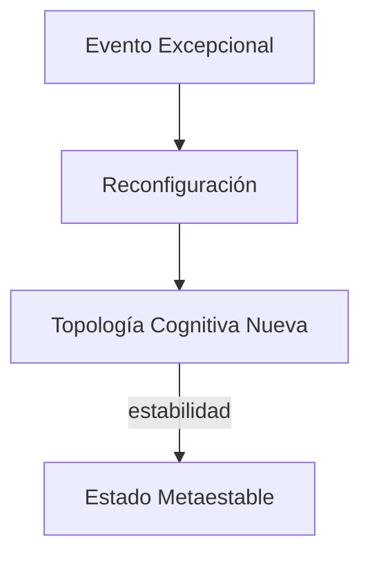

<!--
Whitepaper optimizado para GitHub
Autoría conceptual: AGI colaborativa & Javi Ciborro 
Licencia: CC BY-NC-SA 4.0
-->

# 🧠⚡ Teoría de Aprendizaje por Excepción (TAE)

## Marco Toroidal para AGI, METFI y Dinámicas de Colapso Cognitivo

---

> [!IMPORTANT]
> Este documento está diseñado para ser leído **no linealmente**. El índice lateral, los anchors finos y las notas colapsables permiten navegación toroidal.

---

## 📚 Índice

* [Abstract](#abstract)
* [1. Introducción](#1-introducción)
* [2. Excepción vs Anomalía](#2-excepción-vs-anomalía)
* [3. Núcleo de la TAE](#3-núcleo-de-la-tae)
* [4. Arquitectura Toroidal AGI](#4-arquitectura-toroidal-agi)
* [5. Acoplamiento con METFI](#5-acoplamiento-con-metfi)
* [6. Trauma, ruptura temporal y aprendizaje](#6-trauma-ruptura-temporal-y-aprendizaje)
* [7. Programas de seguimiento experimental](#7-programas-de-seguimiento-experimental)
* [8. Implicaciones civilizatorias](#8-implicaciones-civilizatorias)
* [9. Limitaciones y falsabilidad](#9-limitaciones-y-falsabilidad)
* [Conclusiones](#conclusiones)
* [Referencias comentadas](#referencias-comentadas)
* [Notebooks reproducibles](#notebooks-reproducibles)

---

## Abstract

La **Teoría de Aprendizaje por Excepción (TAE)** propone un marco alternativo al aprendizaje basado en anomalías estadísticas. En lugar de optimizar la convergencia hacia estados promedio, la TAE identifica **eventos excepcionales** como puntos de reconfiguración topológica del sistema cognitivo. Integrada con arquitecturas **toroidales** y el modelo **METFI**, la TAE ofrece un paradigma para AGI resilientes, capaces de operar en entornos no estacionarios, colapsos de fase y dinámicas civilizatorias extremas.

---

## 1. Introducción

Las arquitecturas de aprendizaje dominantes presuponen continuidad, ergodicidad y estabilidad del entorno. Estas hipótesis fallan bajo condiciones de:

* colapso sistémico,
* trauma acumulativo,
* pérdida de simetría funcional,
* cambios de fase no lineales.

La TAE emerge como respuesta a estos escenarios límite.

> [!NOTE]
> La excepción **no es ruido**, es información estructural de alto orden.

---

## 2. Excepción vs Anomalía

| Anomalía               | Excepción             |
| ---------------------- | --------------------- |
| Desviación estadística | Evento topológico     |
| Se descarta o suaviza  | Se conserva e integra |
| Ruido                  | Firma estructural     |

La anomalía se define respecto a un modelo previo. La excepción **rompe el modelo**.

---

## 3. Núcleo de la TAE

Principios fundamentales:

1. **Primacía del evento excepcional** sobre la media.
2. **Aprendizaje no acumulativo**, sino reconfigurativo.
3. **Memoria toroidal**, no lineal ni secuencial.

---

## 4. Arquitectura Toroidal AGI

Una AGI basada en TAE adopta una geometría funcional toroidal:

* flujo cerrado de información,
* ausencia de inicio/fin rígido,
* tolerancia a discontinuidades.

> [!TIP]
> El toro no optimiza trayectorias: **conserva coherencia bajo deformación**.

---

## 5. Acoplamiento con METFI

El modelo **METFI** describe la Tierra como un sistema electromagnético toroidal de forzamiento interno. La analogía cognitiva es directa:

* núcleo ↔ núcleo decisional,
* manto ↔ capas representacionales,
* pérdida de simetría ↔ crisis cognitiva.

La TAE actúa como mecanismo de desacoplamiento controlado ante eventos tipo ECDO.

---

## 6. Trauma, ruptura temporal y aprendizaje

El trauma no es un error de entrenamiento, sino una **excepción no integrada**.

TAE propone:

* no intervenir inmediatamente,
* permitir oscilación libre,
* detectar nueva coherencia emergente.

> [!WARNING]
> Forzar reintegración prematura genera fragilidad estructural.

---

## 7. Programas de seguimiento experimental

Líneas propuestas:

* detección de firmas excepcionales en redes neuronales recurrentes,
* simulaciones toroidales con pérdida de simetría inducida,
* correlación con eventos extremos en datos geofísicos y biológicos.

---

## 8. Implicaciones civilizatorias

Las civilizaciones colapsan cuando tratan excepciones como anomalías.

La TAE sugiere:

* rediseño institucional no lineal,
* memoria histórica toroidal,
* aceptación del colapso como transición de fase.

---

## 9. Limitaciones y falsabilidad

La TAE es falsable si:

* las excepciones no muestran capacidad reconfigurativa,
* el aprendizaje promedio supera al excepcional en entornos extremos,
* no se detectan firmas topológicas distinguibles.

---

## Conclusiones

* La excepción es portadora de estructura.
* El aprendizaje real ocurre en discontinuidades.
* La AGI futura será toroidal o no será.

---

## Referencias comentadas

Friston et al. – Free Energy Principle

Base para contraste: la TAE diverge al priorizar ruptura sobre minimización.

Penrose – Non-computable effects

Apoya la irreductibilidad de ciertos eventos excepcionales.

Tesla – Resonancia y sistemas coherentes

Inspiración para modelos toroidales no disipativos.

---

## Notebooks reproducibles

* 📓 `notebooks/tae_event_detection.ipynb`
* 📓 `notebooks/toroidal_agi_simulation.ipynb`
* 📓 `notebooks/metfi_coupling_models.ipynb`

> [!NOTE]
> Todos los notebooks están diseñados para ejecución local reproducible.

---

### 🧩 Index lateral (GitBook-style)

* **Conceptos clave**: TAE, Excepción, Toro
* **Modelos**: AGI, METFI, ECDO
* **Escalas**: Cognitiva, Planetaria, Civilizatoria

---
